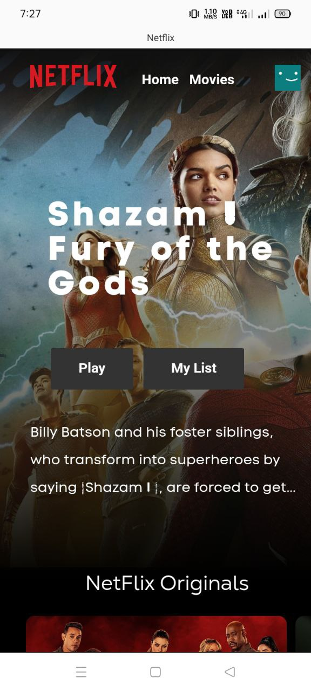

# Netflix-Clone

This is a clone of the Netflix website created using React, and the TMDB API.

## Demo

https://netflix-clone-jerin3j.vercel.app/

## Screenshots

## Features

- Display of popular movies and TV shows from the TMDB API
- Search functionality for movies and TV shows
- Responsive design that works on desktop and mobile devices

## Installation

To run this project on your local machine, clone the repository and install the required dependencies using npm:

